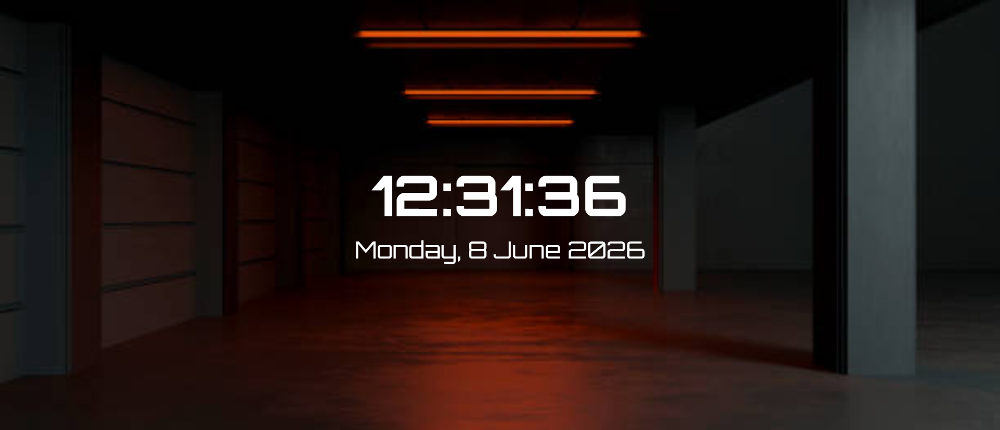

## ⏰ Digital Clock

A simple and responsive Digital Clock built with React and Tailwind CSS. The application displays the current time and date, updating automatically every second using React Hooks.

## Live@
[live@]()
 
## 📸 Preview

## 🚀 Features
🕒 Real-time digital clock
📅 Displays the current date
⚛️ Built with React Hooks (useState & useEffect)
🎨 Styled using Tailwind CSS
📱 Responsive design
🔄 Auto-updates every second

## 🛠️ Technologies Used
 - React
 - Vite
 - Tailwind CSS
 - JavaScript (ES6+)

